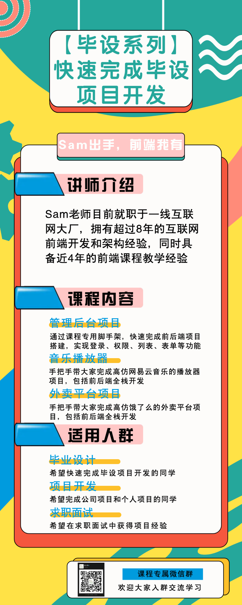

# 【毕设系列】课程规划

## 毕设痛点

- 找项目：找不到靠谱的项目，拿到源码运行不起来
- 改项目：没有开发基础，项目源码不会修改
- 发项目：发布流程太复杂，不会做上线发布

## 课程介绍

## 解决方案

- 找项目：3个100%可运行的项目（会持续更新），通过课程专属工具快速下载、安装和运行项目
- 改项目：手把手教大家怎么对项目进行定制和修改，不讲基础，直截了当
- 发项目：详细的项目部署教学，从服务器购买到部署上线，一应俱全

## 面向用户

有毕业设计需求的在校大学生、有项目开发需求的前端同学、想增加前端项目经验的同学

## 课程大纲

- 第一阶段：管理后台项目框架搭建+登录模块+权限管理模块+列表和表单开发
> 演示系统：[http://fast-learn.youbaobao.xyz/admin](http://fast-learn.youbaobao.xyz/admin)
- 第二阶段：高仿「网易云音乐」音乐播放器项目开发
- 第三阶段：高仿「饿了么」外卖项目开发
> 演示系统：[http://fast-learn.youbaobao.xyz/elm](http://fast-learn.youbaobao.xyz/elm)

## 课程售价

第一期课程**全部免费**

## 怎么学习

登录腾讯课程，搜索"毕设"找到课程就可以报名学习啦

## 课程内容简介

