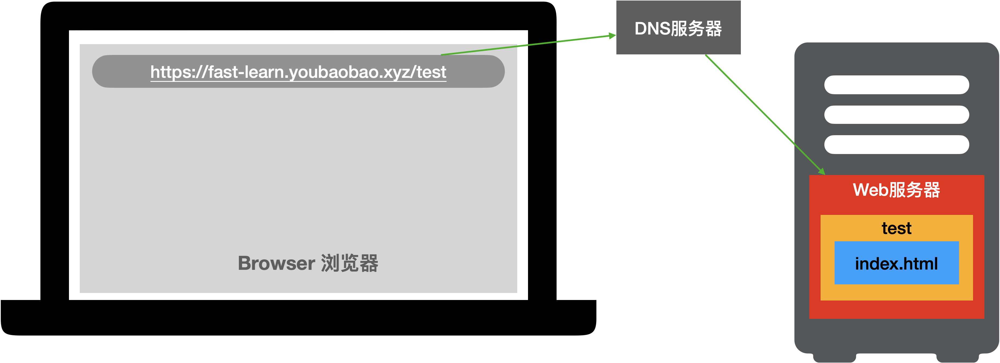

# 3分钟学会前端发布

## 前端发布原理

在浏览器中访问网页的原理：

发布前需要做好的准备工作：
- 购买域名，完成域名备案（阿里云），如果需要支持https服务需要购买SSL证书
- 购买阿里云ECS服务器，可以直接购买带Node镜像的服务，直接完成所有服务部署
- 将域名解析到阿里云ECS服务器
- 服务器上需要部署好Web服务器（如：Nginx等），如需支持https服务需要配置SSL证书的公钥和私钥
- 前端源码文件（这里以[vue2-elm](https://gitee.com/mgh_com/vue2-elm)项目为例）

## 发布流程

发布时我们需要完成以下工作：
- 打包前端源码（通常使用：npm run build）
- 通过ftp将前端源码上传Web服务器
- 通过域名访问自己的应用
